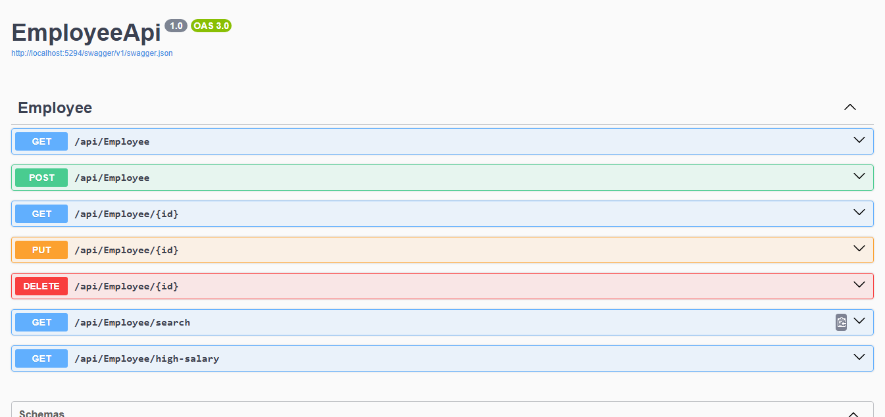

# 👨‍💼 Employee Management System

---

A full-stack **Employee Management System** built using **ASP.NET Core**, **Angular**, and **SQL Server**.
This application allows admins to manage employee records efficiently, including adding, editing, deleting, and viewing employee details.

---

## 🚀 Features
- ✅ Add new employees with personal and professional details
- ✅ Edit existing employee information
- ✅ Delete employees
- ✅ View a list of all employees in a styled table
- ✅ Search employees by name, department, or role
- ✅ Responsive and interactive Angular frontend
- ✅ Backend RESTful APIs tested with Swagger

---

## 🛠️ Tech Stack
- **Backend:** ASP.NET Core (.NET 9)
- **Frontend:** Angular 18
- **Database:** SQL Server
- **Language:** C#, TypeScript, HTML, SCSS

---

## 📸 Screenshot
- EmployeeApi Swagget UI:

---

## 🚀 Author
 **Safeeya Munawwar**
 

  
  
  
  

---

© 2025 Employee Management System | Built with ❤️ using Angular + ASP.NET Core + SQL Server

